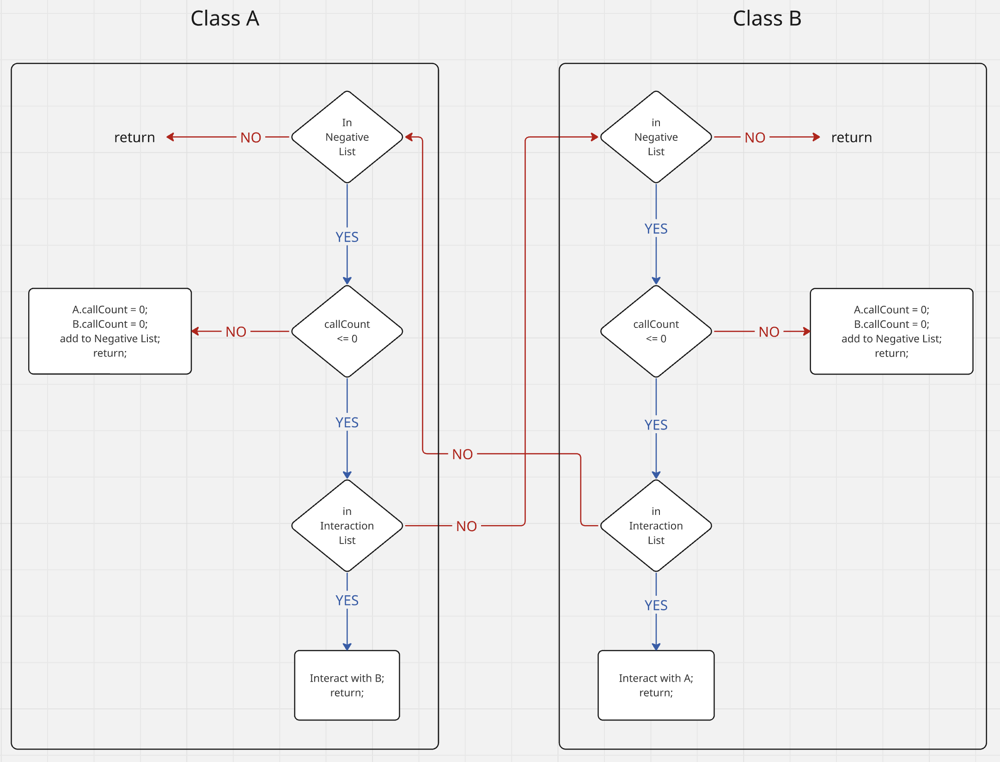

# Summary

Understanding the spatial and regulatory dynamics of the immune response to pulmonary infections remains a central challenge in computational immunology. While mechanistic models, such as ordinary differential equations (ODEs) and partial differential equations (PDEs), offer insights into intracellular and population-level processes, they are limited in representing discrete cellular behaviors and spatial heterogeneity. The pulmonary Agent-based Infection simulator (PAI) addresses this gap through an extensible, multi-scale agent-based modeling framework designed to simulate lung immune responses to pathogens such as *Aspergillus fumigatus, Klebsiella pneumoniae*, and SARS-CoV-2.

PAI operates within a three-dimensional voxelized space that approximates the alveolar microenvironment, incorporating immune cells (macrophages and neutrophils), structural cells (type II pneumocytes), and fungal agents (conidia and hyphae). It models intercellular signaling via diffusing cytokines and chemokines, immune cell recruitment and movement through chemotactic gradients, and pathogen nutrient acquisition strategies. Intracellular regulation is captured using Boolean Networks that govern phenotype transitions such as activation, cytokine secretion, and apoptosis.

The model is implemented in both Java (jPAI) and C++ (PAI++), with identical outputs and comparable performance, though PAI++ significantly reduces memory usage. With its modular architecture and biological fidelity, PAI provides a valuable tool for simulating complex host-pathogen interactions and for conducting in silico experiments where empirical approaches are limited.

# Statement of Need

Respiratory diseases affect hundreds of millions of people, with millions dying prematurely each year (@ferkol2014; @levine2022). Invasive Pulmonary aspergillosis is a human infection with increasing incidence in immunosuppressed patients such as those receiving chemotherapy or organ transplants (@pappas2010). More recently, it has been observed that 10\%-14\% of COVID-19 patients in the ICU develop invasive aspergillosis (@mitaka2021; @chong2021). Despite advances in diagnostics and therapy, mortality remains as high as 30–60\% in recent surveys (@neofytos2013).

Understanding the complex interplay between immune cells, pathogens, and signaling molecules during pulmonary infections requires computational models that capture both the spatial and regulatory dynamics of the immune response (@minucci2020; @yue2022). While mechanistic models such as ODEs or PDEs are effective at simulating intracellular or population-level behavior, they lack the flexibility to represent discrete cellular interactions and heterogeneous spatial environments.

![Figure 1: ABM Architecture. A: Overall architecture of the ABM. At the bottom, in orange, we have the agents. Each “Voxel” (blue) contains a list of agents inside it. The “Voxel” iterates through the agents and executes their public methods. Above the “Voxel,” there is the “Exec” class that has a reference to the array of “Voxels.” The “Exec” class iterates through the array and executes the public methods of the “Voxels.” The “Exec” also performs “garbage collection (gc)” of dead cells, performs diffusion of molecules, and recruits agents. Above everything is the main class. The main class has two tasks: initialize the system and execute the public methods of “Exec.” B: Diagram showing the agent’s classes. Black arrows represent inheritance, while red represents composition. On top, we have the “Interactable” class. This class defines the methods “interact” and “templateInteract.” These two methods are responsible for the pairwise interactions between the agents. Inheriting from the “Interactable” are the classes “Cell” and “Molecule.” “Cell” adds the methods “updateStatus,” “move,” and the auxiliary methods “isDead,” and “kill.” “Molecule” adds the methods “diffuse” and “decay.” The class “IntracellularModel” implements the “updateStatus” method by composition, while the class “Diffusion” implements the method “diffuse” also by composition. The class “Interactions” contains static methods with the actual code for the pairwise interactions. The “templateInteract” method calls these methods. A special type of Molecule called chemokine is responsible for chemoattraction and recruitment, adding the method chemoattract to Molecule. The special kind of cell InfectiousAgent has the ability to multiply and adds the method grow. The “InfectiousAgent” class inherit from Cell and adds the method “grow” that creates new infectious agent’ cells, and the “Chemokine” class inherits from “Molecule” and adds the method “chemoattract” that compute the chemoattraction strength. \label{fig:architecture}](architecture.png)

The Immune System Simulator (PAI) addresses this gap by providing a scalable, extensible agent-based modeling framework for simulating the tissue-scale immune response to lung infections, such as *Aspergillus fumigatus*. PAI integrates extracellular signaling, cellular recruitment, and intracellular signal transduction via Boolean Networks, enabling a multi-scale representation of inflammation, immune regulation, and pathogen dynamics.

PAI is designed to support hypothesis generation, virtual experiments, and mechanistic exploration of host-pathogen interactions, particularly in contexts where in vivo experimentation is challenging. Its architecture facilitates rapid prototyping of new cell types, signaling molecules, and intracellular logic, making it a valuable tool for researchers in immunology, computational biology, and systems medicine. PAI has been used before, and the mathematical and biological components are better explained in @ribeiro2022. While in @ribeiro2023, we modified it to simulate and generate a hypothesis about Covid-Associated-Pulmonary-Aspergillosis (CAPA). And in @qu2025, expanded the original model to simulate the effect of NETosis and hemorrhage on the *Aspergillus* infection. However, none of these papers goes into any detail about the software. PAI was developed to simulate Invasive Aspergillosis, but the code can be easily extended to simulate other respiratory infections.

# Implementation and Architecture

## Overview

The Pulmonary Agent-based Infection simulator (PAI) is an agent-based model designed to simulate the immune response to *Aspergillus fumigatus*. The model focuses primarily on tissue-scale immune dynamics and integrates intracellular processes via Boolean Networks. The ABM operates in a 3D voxelized space that mimics a small region of lung alveoli. It includes key immune cells like macrophages and neutrophils, structural cells like type II pneumocytes, and fungal agents such as resting conidia and hyphae of *A. fumigatus*. Cytokines and chemokines are represented as diffusing molecules that mediate intercellular communication.
Core dynamics include:

Core dynamics include:
 - Activation of immune and epithelial cells upon contact with fungi.
 - Secretion and diffusion of cytokines/chemokines governed by PDEs.
 - Chemotaxis-driven movement and recruitment of leukocytes.
 - Fungal iron acquisition via siderophores (e.g., TAFC) competing with host defense molecules (e.g., Lactoferrin).
 - Cell state transitions (e.g., activation, apoptosis) driven by intracellular Boolean Networks.

Each agent (cell or molecule) operates autonomously, interacts within its voxel, and can change state over time. The simulation captures emergent behaviors like inflammation resolution, immune recruitment, and fungal clearance or persistence.

## Architecture

The Immune System Simulator (PAI) architecture is structured in a hierarchical, object-oriented framework with extensibility and computational efficiency in mind (Figure 1A). At the top level, a Main class orchestrates the initialization and execution of simulations, including setting up initial conditions, managing output, and controlling the simulation loop. Initialization is handled by a dedicated Initializer class, which instantiates the molecular fields, populates the simulation space with agents, and assigns intracellular models where appropriate.

The simulation domain is discretized into a three-dimensional voxel grid, where each voxel represents a microenvironment (~40 µm per side) and maintains localized lists of agents. The Voxel class governs local interactions (interact method), molecular degradation (degrade method), and cell updates (update method) and is invoked iteratively by the Exec class. The Exec class also handles molecular diffusion (via PDE solvers), cellular recruitment (based on chemokine gradients), and agent-level garbage collection.

Agents in the PAI are broadly categorized as Cells or Molecules, both inheriting from an abstract Interactable class (Figure 1B). This base class implements a symmetric interact method based on an “inductive” architecture: new agent types define how they interact with existing agents, streamlining model expansion. The templateInteract method governs the specific pairwise interaction logic, while agent behavior (e.g., migration, phagocytosis, secretion) is defined in subclass implementations. If Agent “A” does not provide code to interact with Agent “B,” nor does Agent “B” provide code to interact with “A,” they learn on the fly that they do not interact. Therefore, the next time an interaction is attempted between “A” and “B”, it is refused (Figure 2).

The agents may have several methods to handle their behavior. In general, these methods must be called by the updateStatus method because the latter is the one that will be called in the Voxel class. The most common method found in agents is: updateBooleanNetwork, which handles the intracellular dynamics of the cell, grow, for cells that multiply (InfectiousAgent subclass), move, for cells that move, instead, to test if a cell is dead, kill used by leukocytes to kill other cells. 

## Model Instantiation

A typical instantiation of the PAI model, as used in @ribeiro2022, involves a 10×10×10 voxel grid populated with both cellular and molecular agents. The simulation initializes many molecular fields—represented by dedicated molecule agents—Transferrin, Lactoferrin, TAFC, Iron, IL-6, TNF-α, IL-10, TGF-β, CXCL2, CCL4, and Hepcidin. These agents manage their internal 3D arrays that mirror the voxel structure. While conceptually, there is one molecule per voxel, each voxel instead holds a reference to the molecule agent (molecule object), ensuring computational efficiency.

In addition to molecular agents, the model is initialized with 640 Type II pneumocytes, 15 macrophages, 15 neutrophils, and 1920 *Aspergillus fumigatus* (in the resting conidia state) randomly distributed across the grid. @ribeiro2022 also has a simplified model of liver, that is represented as a cell agent that is present in every voxel and interacts with IL6, Hepcidin, and Transferrin. The molecules and cell types are the orange boxes at the bottom of Figure 1A. 

The simulation proceeds via the Exec class, which iterates over all voxels and over the lists of agents they contain. Depending on agent type, this iteration handles molecular degradation (molecules), cellular state transitions (cells), migration (cells), cell division (infectious agent cell), and stochastic pairwise interactions (both). In @ribeiro2022, there is a library of atomic interactions coded in the class Interaction (Figure 1B) that handles phagocytose and killing of *Aspergillus* by macrophage or neutrophil, binding of a molecule to the cell receptor, secretion of molecules, uptake of TAFC and Iron, activation of type II pneumocytes by *Aspergillus*, and iron exchange between iron chelators (molecule reaction between iron chelators such as TAFC and Transferrin). Some of these kinds of interactions are handled by a single static method in the class Interaction, while others have multiple methods handling each particular case. 

@ribeiro2022, implement the chemokines CCL4 and CXCL2 and the Recruiter classes MacrophageRecruiter and NeutrophilRecruiter read their global levels (Figure 1A - left). These classes generate new macrophages and neutrophils at random positions within the voxel grid. The number of cells created is a function of the global level of chemokine read.

The Exec class code is executed iteratively, and each execution step represents 2 minutes of simulated time. Simulations typically run for 2160 iterations (approximately 72 hours), as in @ribeiro2022, where results were quantitatively compared with *in vivo* murine infection data and demonstrated close agreement. Representative outputs from these simulations are shown in Figure 3A–B.

![Figure 3: Comparison of Java and C++ version of PAI. A: Comparison of Macrophage time series. Average of a hundred simulations. Differences were assessed with a paired t-test. B: Comparison of TNF-a time series. Average of a hundred simulations. Differences were assessed with a paired t-test. C: Running time comparison of a hundred simulations. Differences were assessed with the Wilcoxon rank-sum test. D: Memory usage over time of a single simulation. Memory usage for the C++ simulations was recorded using the Valgrind tool, while for Java, we used JProfiler. Differences were assessed with the Wilcoxon rank-sum test. All figures were created with simulations starting with 10X10X10 voxels, 640 pneumocytes, 1920 initial conidia, 15 initial macrophages, 209 maximum macrophages, 522 maximum neutrophils, and 2160 iterations. Each simulated hour corresponds to 30 iterations. Except for the difference in implementation language (C++ and Java), stochastic factors, all simulations were supposed to be identical. The C++ version was compiled with g++ 12.4.0 using the MinGW toolchain with level three optimization; the Java version used Java 23.0.1. All simulations were run on a Windows 10 Education 64-Bit Dell laptop, Intel® Core™ Ultra 7 155U (14CPUs), ~2.1GHz, 16384MB RAM. Statistical significance was assessed using the Wilcoxon rank-sum test. (ns not significant p > 0.05; **** p < 0.0001). ß \label{fig:benchmark}](Benchmark.png)

## Benchmark

We built this model initially in Java (jPAI), but we created a C++ version (PAI++) subsequently for the code in @ribeiro2022. jPAI, on the other hand, contains the @ribeiro2022 and @qu2025 codes, as well as other pieces of code not discussed in this paper. The code used for this benchmark is a simplification of @ribeiro2022 (Hepcidin and Liver were excluded). Within this context, PAI++ and jPAI are nearly identical (Figure 3A-B). The Benchmark.pdf file provides a thorough comparison between the outputs of the two versions, showing that differences are, in general, not statistically significant or have only negligible effects. One of the largest differences is in hyphae. However, only a few hyphae are ever formed in the simulations, and therefore, their small numbers are subject to stochastic fluctuations and minor implementation biases.

Figure 3C shows that the running time (wall time) of both implementations is similar (~11 sec), with C++ being slightly faster. The Benchmark.pdf file shows that this advantage of C++ is higher or lower depending on the environment. In Debian (via Windows Subsystem Linux – Maroon), it was almost twice as fast as in Windows, even though this was the same computer, and Debian was running on top of Windows. On the other hand, there were major differences in the memory usage (Figure 3D). While PAI++ uses a few megabytes, the Java version takes more than a hundred megabytes. The difference is probably due to the garbage collection. While the C++ version has code to explicitly free the memory every time an agent is deleted, the jPAI version depends on the Java garbage collection system. A more thorough comparison of results, running time, and memory usage is provided in the Benchmark.pdf file. The similarity between the two implementations serves as an important benchmark for model reproducibility, a key target in the modeling community (@donkin2017; @masison2021).

# References

